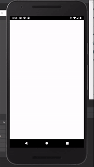

<h1 align="center">Desafio tecnico da <a href="https://jobs.kenoby.com/frameworkpadawans">Framework Padawans</a></h1>

📱 App que busca e manipula informações dadas em uma API publica

### Pré-requisitos

Antes de começar, você vai precisar ter instalado em sua máquina o flutter e o dart SDK.

### 🎲 Rodando na IDE

<h4 Clone este repositório</h4>
$ git clone <https://github.com/lemarinhofernandes/padawans_desafio.git>

<h4 Abra uma IDE que suporte o Flutter e ajuste seus plugins</h4>

<h4 Abra o repositorio clonado</h4>

<h4 Configure o flutter e dart SDK</h4>

<h4 Abra seu emulador de smartphone</h4>

<h4 Dê "run" na "main.dart"</h4>

   

